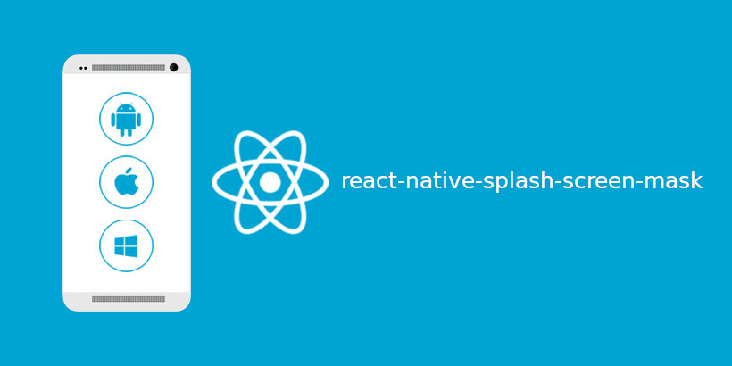

# react-native-splash-screen-mask



A splash screen for react-native, It hide when application loaded. It works on iOS, Android and Window.


<!--

## Getting started

`$ npm install react-native-splash-screen-mask --save`

### Mostly automatic installation

`$ react-native link react-native-splash-screen-mask`

## Usage
```javascript
import RNSplashScreenMask from 'react-native-splash-screen-mask';

// TODO: What to do with the module?
RNSplashScreenMask;
```
-->
